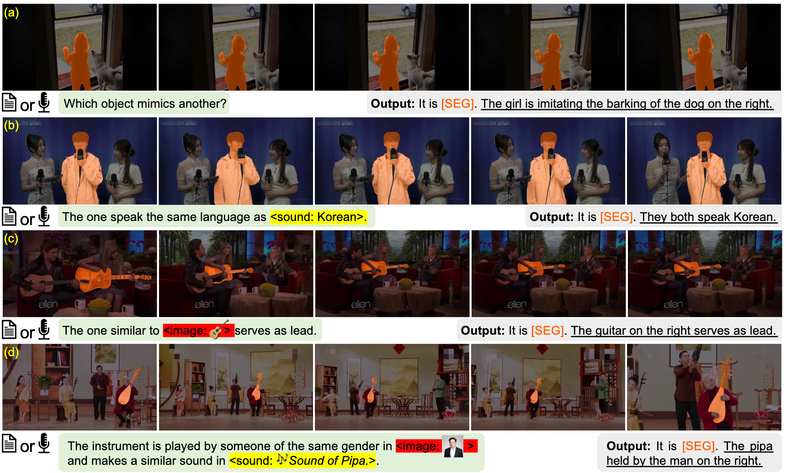

<p align="center">
  <h2 align="center">Towards Omnimodal Expressions and Reasoning in <br>
  Referring Audio-Visual Segmentation</h2>
  <p align="center">
    <a><strong>Kaining Ying</strong>
    ·
    <a href=https://henghuiding.com/><strong>Henghui Ding</strong></a><sup> ✉️ </sup>
    ·
    <a><strong>Guangquan Jie</strong></a>
    ·
    <a><strong>Yu-Gang Jiang</strong></a>
</p>

<p align="center">
    Fudan University, China
</p>

<p align="center">
    <a href=https://iccv.thecvf.com/>ICCV 2025, Honolulu, Hawai'i</a>
</p>

<p align="center">
  
</p>

<strong>TL;DR:</strong> OmniAVS aims to segment objects in audiovisual videos based on multimodal referring expressions that flexibly combine text, speech, sound, and visual cues, requiring deep understanding and reasoning about audiovisual content.

# News

- **20250928** | Code and dataset are released.
- **20250627** | OmniAVS is accepted by ICCV 2025! 🌺🏄‍♂️🌴

# Dataset Preparation

Download OmniAVS from [huggingface 🤗](https://huggingface.co/datasets/FudanCVL/OmniAVS/tree/main).

# Environment Setup

```shell
git clone https://github.com/FudanCVL/OmniAVS.git
cd OmniAVS

conda create -n omniavs python=3.10 -y
conda activate omniavs

pip install -r playground/requirements.txt
pip install flash-attn --no-build-isolation
python -m pip install 'git+https://github.com/facebookresearch/detectron2.git'  # install detectron2

cd playground/transformers && pip install -e . && cd ../../

cd ops && sh make.sh && cd ../../../../
```

# Train

We use other datasets to pretrain and SFT our model. You should place all the datasets in `playground/data`. The directory structure of `playground/data` is as follows:

Below is a list of each dataset's name, data root directory (root), and annotation file (annotation jsonl). For some segmentation datasets, please refer to [VISA](https://github.com/cilinyan/VISA) for download instructions, and download the annotation jsonl files from [here](https://huggingface.co/datasets/FudanCVL/OmniAVS/tree/main/annotation_jsonl).

| name                                   | root                                                                                      | annotation jsonl                                                        |
|---------------------------------------- |------------------------------------------------------------------------------------------|-------------------------------------------------------------------|
| [auto_acd_vggsound_train_159917](https://huggingface.co/datasets/Loie/VGGSound)          | playground/data/auto_acd/vggsound/scratch/shared/beegfs/hchen/train_data/VGGSound_final/video | playground/data/auto_acd/auto_acd_vggsound_train_159917.jsonl     |
| [auto_acd_audioset_train_1695912](https://github.com/MorenoLaQuatra/audioset-download)         | playground/data/auto_acd/audioset_audio_file/audio/unbal_train                            | playground/data/auto_acd/auto_acd_audioset_train_1695912.jsonl    |
| [clotho_aqa_train_6085](https://zenodo.org/records/6473207)                   | playground/data/clotho_aqa/audio_files                                                    | playground/data/clotho_aqa/clotho_aqa_train_6085.jsonl            |
| [wavcaps_train_108317](https://github.com/XinhaoMei/WavCaps)                    | playground/data/wavcaps/Zip_files/AudioSet_SL/mnt/fast/nobackup/scratch4weeks/xm00178/WavCaps/data/waveforms/AudioSet_SL_flac | playground/data/wavcaps/wavcaps_train_108317.jsonl                |
| [musiccaps_train_4753](https://huggingface.co/datasets/google/MusicCaps)                    | playground/data/musiccaps/metadata/wav                                                    | playground/data/musiccaps/musiccaps_train_4753.jsonl              |
| [vocalsound_train_15531](https://huggingface.co/datasets/MahiA/VocalSound/tree/main)                  | playground/data/vocalsound/audio_16k                                                      | playground/data/vocalsound/vocalsound_train_15531.jsonl           |
| [aishell2_asr_zh_train_47200](https://huggingface.co/datasets/OpenGVLab/ShareGPT-4o/tree/main/audio_pretrain)             | playground/data/sharegpt4o/mnt/petrelfs/wangweiyun/workspace_cef/dataset/Aishell-2/       | playground/data/sharegpt4o/aishell2_asr_zh_train_47200.jsonl      |
| [commonvoice_asr_zh_train_24051](https://huggingface.co/datasets/OpenGVLab/ShareGPT-4o/tree/main)          | playground/data/sharegpt4o/mnt/petrelfs/wangweiyun/workspace_cef/dataset/commonvoice/     | playground/data/sharegpt4o/commonvoice_asr_zh_train_24051.jsonl   |
| [commonvoice_asr_en_train_4063](https://huggingface.co/datasets/OpenGVLab/ShareGPT-4o/tree/main)           | playground/data/sharegpt4o/mnt/petrelfs/wangweiyun/workspace_cef/dataset/commonvoice/     | playground/data/sharegpt4o/commonvoice_asr_en_train_4063.jsonl    |
| [gigaspeech_asr_zh_train_301723](https://huggingface.co/datasets/OpenGVLab/ShareGPT-4o/tree/main)          | playground/data/sharegpt4o/mnt/petrelfs/wangweiyun/workspace_cef/dataset/GigaSpeech/audio_segment | playground/data/sharegpt4o/gigaspeech_asr_zh_train_301723.jsonl   |
| [magicdata_ramc_asr_zh_train_113725](https://huggingface.co/datasets/OpenGVLab/ShareGPT-4o/tree/main)      | playground/data/sharegpt4o/mnt/petrelfs/wangweiyun/workspace_cef/dataset/magicdata_ramc   | playground/data/sharegpt4o/magicdata_ramc_asr_zh_train_113725.jsonl |
| [gigaspeech_asr_en_m_processed_train_485799](https://github.com/SpeechColab/GigaSpeech) | playground/data/gigaspeech/annotation/data/all_audio                                      | playground/data/gigaspeech/gigaspeech_asr_en_m_processed_train_485799.jsonl |
| [ade20k](https://ade20k.csail.mit.edu/)                    | playground/data/segmentation/ade20k                                                      |  |
| [reason_seg](https://github.com/dvlab-research/LISA)                               | playground/data/segmentation/reason_seg/train                                            |  |
| [grefcoco](https://github.com/henghuiding/gRefCOCO)                                   | playground/data/segmentation/lisa_data/refer_seg                                         |  |
| [refcoco](https://github.com/lichengunc/refer)                                    | playground/data/segmentation/lisa_data/refer_seg                                         |  |
| [refcoco+](https://github.com/lichengunc/refer)                                   | playground/data/segmentation/lisa_data/refer_seg                                         |  |
| [refcocog](https://github.com/lichengunc/refer)                                   | playground/data/segmentation/lisa_data/refer_seg                                         |  |
| [cocostuff](https://github.com/nightrome/cocostuff)                               | playground/data/segmentation/lisa_data                                                   |  |
| [pascal_part](https://roozbehm.info/pascal-parts/pascal-parts.html)                                 | playground/data/segmentation/lisa_data                                                   |  |
| [paco_lvis](https://github.com/facebookresearch/paco)                                 | playground/data/segmentation/lisa_data                                                   |  |
| [lvvis](https://github.com/dvlab-research/LISA) | playground/data/segmentation/lvvis/train/ |  |
| [mevis](https://github.com/dvlab-research/LISA) | playground/data/segmentation/mevis/train/ |  |
| [revos](https://github.com/dvlab-research/LISA) | playground/data/segmentation/revos |  |
| [refer_ytvos](https://github.com/wjn922/Refer-YTVOS) | playground/data/segmentation/refer_ytvos/train |  |
| [refer_davis](https://github.com/wjn922/Refer-DAVIS) | playground/data/segmentation/davis17/train |  |
| [refavs](https://github.com/GeWu-Lab/Ref-AVS) | playground/data/segmentation/refavs/train |  |
| [omniavs](https://huggingface.co/datasets/FudanCVL/OmniAVS) | playground/data/segmentation/omniavs |  |

You also need to download the corresponding pretrained weights and place them in `playground/pretrained`, including [InternVL2-1B](https://huggingface.co/OpenGVLab/InternVL2-1B), [internomni_whisper](https://huggingface.co/FudanCVL/OISA-Train/tree/main/internomni_whisper), and [model_final.pth](https://huggingface.co/FudanCVL/OISA-Train/blob/main/model_final.pth).

The training consists of two parts: pretraining and SFT. The SFT process is further divided into three stages.
```shell
# pretrain
bash shell/oisa_1b_stage1.sh
python merge_lora.py work_dirs/oisa_1b_stage1_audio_text_align work_dirs/oisa_1b_stage1_audio_text_align_merged

# SFT: stage1
bash shell/oisa_1b_stage2.sh
python merge_lora.py work_dirs/oisa_1b_stage2_sft_image work_dirs/oisa_1b_stage2_sft_image_merged

# SFT: stage2
bash shell/oisa_1b_stage3.sh
python merge_lora.py work_dirs/oisa_1b_stage3_sft_video_audio work_dirs/oisa_1b_stage3_sft_video_audio_merged

# SFT: stage3
bash shell/oisa_1b_stage3.sh
python merge_lora.py work_dirs/oisa_1b_stage4_sft_omniavs work_dirs/oisa_1b_stage4_sft_omniavs_merged
```

# Test
```
torchrun --nproc_per_node=8 evaluate.py --checkpoint FudanCVL/OISA-1B-OmniAVS --datasets all --out-dir output
```

# Acknowledgements

We would like to express our gratitude to the following projects that have contributed to our work:

- [InternVL](https://github.com/OpenGVLab/InternVL) & [InternOmni](https://internvl.github.io/blog/2024-07-27-InternOmni/) & [Whisper](https://huggingface.co/openai/whisper-large-v3) & [Mask2Former](https://github.com/facebookresearch/Mask2Former)
- [Ref-AVS](https://github.com/GeWu-Lab/Ref-AVS) & [VGGSound](https://github.com/hche11/VGGSound) & [TVQA](https://nlp.cs.unc.edu/data/jielei/tvqa/tvqa_public_html/index.html) & [AVSBench](https://github.com/OpenNLPLab/AVSBench)

We also thank all the annotators who contributed to the creation of our dataset and the reviewers for their valuable feedback.

# License

OmniAVS is licensed under a CC BY-NC-SA 4.0 License. The data of OmniAVS is released for non-commercial research purpose only. Since OmniAVS incorporates partial videos from previous datasets (eg, Ref-AVS, VGGSound, TVQA, AVSBench), users must also comply with the licenses of those original datasets.

# Citation
If you find our paper and dataset useful for your research, please generously cite our paper.

```
@inproceedings{omniavs,
    title={{T}owards {O}mnimodal {E}xpressions and {R}easoning in {R}eferring {A}udio-{V}isual {S}egmentation, 
    author={Kaining Ying and Henghui Ding and Guangquan Jie and Yu-Gang Jiang},
    year={2025},
    booktitle={ICCV}
}
```
