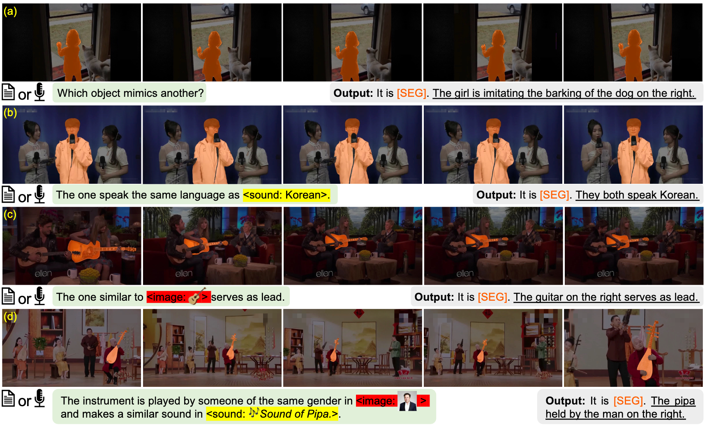

<p align="center">
  <h2 align="center">Towards Omnimodal Expressions and Reasoning in <br>
  Referring Audio-Visual Segmentation</h2>
  <p align="center">
    <a><strong>Kaining Ying</strong>
    ·
    <a href=https://henghuiding.com/><strong>Henghui Ding</strong></a><sup> ✉️ </sup>
    ·
    <a><strong>Guangquan Jie</strong></a>
    ·
    <a><strong>Yu-Gang Jiang</strong></a>
</p>

<p align="center">
    Fudan University, China
</p>

<p align="center">
    <a href=https://iccv.thecvf.com/>ICCV 2025, Honolulu, Hawai'i</a>
</p>

<p align="center">
  
</p>

# News

- **20250728** | Code and dataset will be released in August. Stay tuned:)


<!-- # 📥 Dataset Preparation

Coming soon.

# Environment Setup


```
conda create -n omniavs python=3.10 -y
conda activate omniavs

pip install -r playground/requirements.txt
pip install flash-attn --no-build-isolation
python -m pip install 'git+https://github.com/facebookresearch/detectron2.git'  # install detectron2

cd playground/transformers && pip install -e . && cd ../../

cd ops && sh make.sh && cd ../../../../

```

# 🏋️‍♂️ Train

Coming soon.

# 🧪 Test

Coming soon. -->


<!-- # 🙏 Acknowledgements

We would like to express our gratitude to the following projects that have contributed to our work:

- [InternVL](https://github.com/OpenGVLab/InternVL) & [Mask2Former]()
- [Ref-AVS]() & [VGGSound]() & [TVQA]() & [AVSBench]()

We also thank all the annotators who contributed to the creation of our dataset and the reviewers for their valuable feedback.


# 📄 License

OmniAVS is licensed under a CC BY-NC-SA 4.0 License. The data of OmniAVS is released for non-commercial research purpose only. Since OmniAVS incorporates partial videos from previous datasets (eg, Ref-AVS, VGGSound, TVQA, AVSBench), users must also comply with the licenses of those original datasets. -->

# 📇 Citation
If you find our paper and dataset useful for your research, please generously cite our paper.

```
@inproceedings{ying2025omniavs,
    title={{T}owards {O}mnimodal {E}xpressions and {R}easoning in {R}eferring {A}udio-{V}isual {S}egmentation, 
    author={Kaining Ying and Henghui Ding and Guangquan Jie and Yu-Gang Jiang},
    year={2025},
    booktitle={ICCV}
}
```
